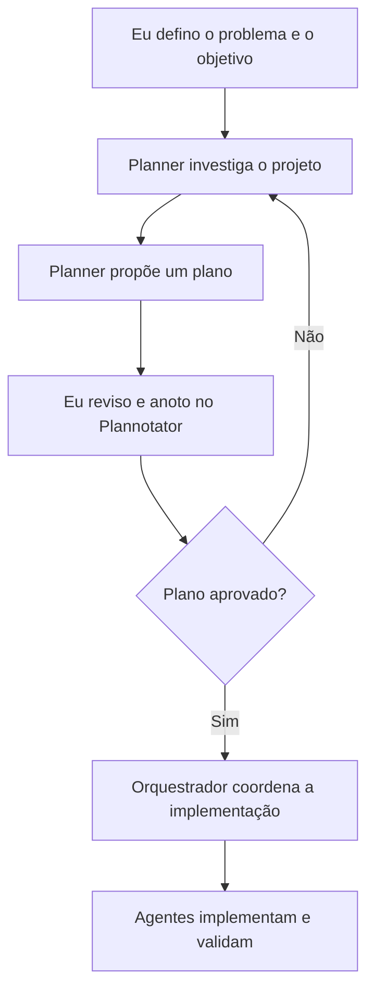
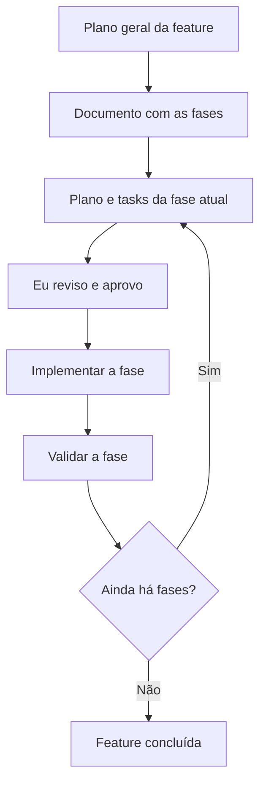

---

title: Como venho usando IA no desenvolvimento
slug: como-venho-usando-ia-no-desenvolvimento
summary: O caminho que me levou do copia e cola a um fluxo de IA mais simples, consistente e sob controle.
publishDate: 2026-09-17
language: pt
translationKey: how-i-use-ai-in-my-development-workflow
tags:
  - IA
  - Desenvolvimento
  - OpenCode
  - Agentes
category: Desenvolvimento
translationAvailable: true
draft: false

---

## Como eu cheguei até aqui

Minha primeira experiência com LLM no desenvolvimento foi a mais óbvia: eu abria um chat, descrevia o que queria, copiava a resposta, colava no projeto e torcia para aquilo funcionar. Às vezes funcionava. Quando não funcionava, eu copiava o erro de volta para o chat e começava o ciclo outra vez.

Era útil, mas havia uma distância enorme entre a conversa e o código real. O modelo não conhecia o projeto inteiro, eu precisava transportar o contexto manualmente e quase sempre estava pedindo soluções pontuais para problemas que faziam parte de um sistema maior.

## A velocidade veio antes da qualidade

Depois entrei no mundo dos harnesses através do Roo Code. Em termos simples, o Roo Code é uma extensão do VS Code que permite trabalhar com agentes capazes de ler e alterar arquivos do projeto. Isso já muda bastante a experiência: em vez de copiar e colar cada trecho, o agente consegue investigar o repositório, editar o código e continuar a tarefa no próprio ambiente.

Para protótipos, a velocidade foi impressionante. Eu conseguia sair de uma ideia para alguma coisa funcionando muito mais rápido. O problema é que velocidade não é a mesma coisa que qualidade. Muitas vezes, o código que aparecia no final era ruim: arquivos gigantes, responsabilidades misturadas, duplicação e god classes ou god components.

O harness estava executando a tarefa, mas eu ainda não tinha um processo bom para orientar o trabalho. Eu estava confundindo um resultado que rodava com um resultado que eu conseguiria manter.

## Descobri os prompts de sistema — e compliquei tudo

Foi aí que comecei a estudar prompts de sistema, agentes especializados e coordenação entre agentes. A ideia parecia boa: cada agente teria uma responsabilidade clara, um agente poderia investigar, outro implementar, outro revisar, e um coordenador organizaria tudo.

Só que eu exagerei na complexidade. Comecei a criar camadas, regras, papéis e etapas demais. O harness ficou tão cheio de estrutura que passou a exigir mais manutenção e atenção do que eu queria gastar em projetos pequenos. Eu tinha trocado o caos do copia e cola por um processo sofisticado demais para o problema.

## As tentativas que não pagaram a conta

Também tentei agentes que vasculhavam o projeto inteiro para montar contexto e experimentei RAG em projetos pessoais pequenos. As duas abordagens tinham valor técnico, mas custo e complexidade que não compensavam o tamanho dos projetos.

Nem toda possibilidade interessante precisa entrar no fluxo. Em um projeto pequeno, manter a infraestrutura, alimentar o contexto e lidar com as consequências pode custar mais do que simplesmente abrir os arquivos relevantes e explicar o objetivo. Depois dessas tentativas, desisti temporariamente de usar harnesses.

## A volta

Mais tarde, voltei a experimentar usando OpenCode junto com o ChatGPT Plus e os modelos GPT 5.3. A experiência melhorou. Não porque eu tivesse encontrado uma configuração mágica, mas porque eu já tinha entendido melhor os problemas do meu próprio processo e conseguia avaliar as respostas com mais cuidado.

Passei meses testando `AGENTS.md`, subagentes, plugins, MCPs e diferentes métodos de trabalho. Também testei e questionei o uso de SDD. Acho que SDD pode fazer sentido para equipes grandes, com muitas pessoas precisando compartilhar uma especificação e uma direção comum. Para um dev solo trabalhando em um projeto pequeno, porém, pode ser estrutura demais: documentação demais, etapas demais e contexto demais para uma decisão que o próprio desenvolvedor já consegue acompanhar.

Minha crítica não é que SDD seja inútil. É que uma prática criada para resolver problemas de coordenação maiores pode virar burocracia quando aplicada sem medida. Especificar não substitui pensar, e gerar documentos não significa que o objetivo ficou mais claro.

Meu fluxo atual ainda não é perfeito. Ele é a tentativa mais recente de manter o harness simples e sob controle, sem abrir mão de consistência e qualidade. A meta não é tirar o desenvolvedor do processo. É usar os agentes para reduzir trabalho mecânico e organizar melhor o trabalho que continua sendo responsabilidade humana.

TDD e testes unitários são obrigatórios na minha visão. Eles fazem parte do meu desenvolvimento, mas ficam fora do escopo deste artigo.

## Quem guarda o quê

Uma das coisas mais importantes que aprendi foi separar responsabilidades. Memória, entendimento do código e regras operacionais não são a mesma coisa.

### `ai-memory`: passado e contexto entre sessões

O `ai-memory` é o MCP que uso como memória de longo prazo e histórico entre sessões. Eventos cotidianos podem ser capturados automaticamente. Depois, os agentes conseguem consultar e recuperar contexto, gotchas e handoffs quando isso for relevante para o trabalho.

Isso não transforma tudo em regra automática. Eu ainda preciso validar a evidência recuperada e decidir se alguma descoberta merece virar conhecimento durável. Um registro de que algo aconteceu, uma hipótese e uma regra que deve ser obedecida são coisas diferentes.

### Serena: entendimento semântico do código

Serena serve para entender o código semanticamente: símbolos, referências, implementações e relações entre as partes do projeto. Ela ajuda o agente a responder perguntas sobre como o código está organizado e quais consumidores podem ser afetados por uma mudança.

As memórias do Serena são resumos técnicos estáveis. Elas não são criadas automaticamente a cada evento. Quando preciso, peço um onboarding, salvo uma memória ou reviso o conteúdo depois de uma mudança estrutural. A memória deve descrever o funcionamento atual do sistema, não o histórico de cada conversa.

### `AGENTS.md`: regras operacionais obrigatórias

O `AGENTS.md` contém as instruções operacionais obrigatórias do projeto. É onde ficam as regras que os agentes precisam seguir sempre que trabalham naquele escopo.

Uma instrução pode ser descoberta durante uma conversa ou recuperada pelo `ai-memory`, mas isso não a promove automaticamente. A promoção para `AGENTS.md` é manual, validada e aprovada por mim. Assim, uma sugestão útil não vira uma regra permanente por acidente.

Esta é a tabela de decisão que tento manter:

| Tipo de informação | Fonte |
| --- | --- |
| Passado, eventos e histórico entre sessões | `ai-memory` |
| Funcionamento atual e entendimento técnico do código | Serena |
| Regras que devem valer sempre | `AGENTS.md` |
| Razões e decisões arquiteturais | `docs/ADR` |

## Meu fluxo para tarefas relevantes

Para tarefas relevantes, eu não começo pedindo que um agente implemente diretamente. Primeiro mando o trabalho para um agente planner. O planner investiga o projeto e propõe um caminho: arquivos envolvidos, impactos, dúvidas, riscos e etapas possíveis.

O planner não define o objetivo. O objetivo vem de mim. Depois que recebo a proposta, reviso, faço anotações e aprovo ou rejeito o plano no Plannotator. Só depois da aprovação o orquestrador coordena a implementação.

Essa aprovação é uma barreira importante. O agente pode encontrar um caminho tecnicamente possível que não corresponde ao que eu quero, ou pode propor uma mudança maior do que o escopo necessário. A revisão antes da implementação evita transformar uma interpretação do agente em decisão do projeto.

## Quando a feature é complexa

Para features complexas, separo o trabalho em fases. Primeiro crio um plano geral e um documento descrevendo as fases. Em seguida, para cada fase, gero um plano e as tasks específicas. Aprovo esse material antes de implementar.

Depois a fase é implementada e validada. Só quando ela está concluída sigo para a próxima. Isso mantém o contexto menor, cria pontos de revisão e evita tentar resolver uma feature inteira em uma única rodada.

O documento de fases também torna explícito o que não está sendo feito agora. Isso ajuda a controlar o escopo e dá ao orquestrador um próximo passo claro, em vez de deixá-lo tentar antecipar todas as decisões futuras.

## O papel do orquestrador e o meu

O orquestrador delega investigação, documentação, análise, implementação e validação para os agentes mais adequados. Ele coordena o trabalho e mantém as etapas conectadas, mas não substitui a direção do projeto.

Eu mantenho a decisão final sobre o problema, o escopo, as aprovações e o caminho a seguir. Também mantenho um `roadmap.md` na raiz do projeto. Nele registro as fases, o progresso, as pendências e a direção humana do trabalho. O roadmap não é uma autorização para o agente inventar a próxima prioridade; é a forma que uso para deixar minhas próprias decisões visíveis.

## O que esse fluxo tenta resolver

Eu não quero um agente que simplesmente concorde comigo, nem um harness que tome conta do projeto. Quero um processo em que o agente consiga pesquisar, organizar, implementar e validar sem que eu entregue a ele decisões que ainda não tomei.

No fim, a divisão é simples:

- agentes pesquisam;
- agentes organizam;
- agentes implementam;
- agentes validam;
- eu defino o problema;
- eu reviso o plano;
- eu aprovo o caminho;
- eu decido quais regras merecem ser permanentes.

Ainda estou ajustando esse fluxo. Mas, até agora, manter as responsabilidades separadas e o harness sob controle tem produzido resultados mais consistentes do que tentar automatizar cada parte do desenvolvimento.
