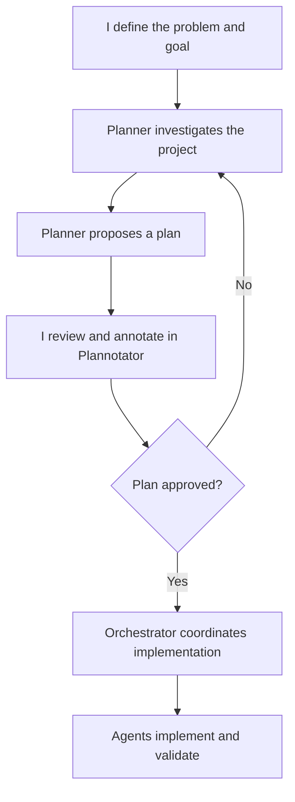
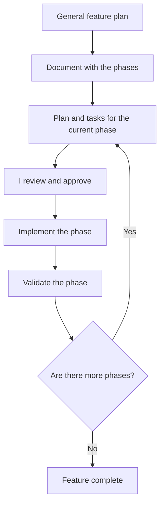

---

title: How I Use AI in My Development Workflow
slug: how-i-use-ai-in-my-development-workflow
summary: How I moved from copy-pasting with chatbots to a simpler, more consistent AI development workflow.
publishDate: 2026-09-17
language: en
translationKey: how-i-use-ai-in-my-development-workflow
tags:
  - AI
  - Development
  - OpenCode
  - Agents
category: Development
translationAvailable: true
draft: false

---

## How I got here

My first experience with LLMs in development was the obvious one: I opened a chat, described what I wanted, copied the answer, pasted it into the project, and hoped it would work. Sometimes it did. When it didn't, I copied the error back into the chat and started the cycle again.

It was useful, but there was a huge distance between the conversation and the real code. The model didn't know the whole project, I had to move context around manually, and I was usually asking for isolated solutions to problems that were part of a larger system.

## Speed came before quality

Then I entered the world of harnesses through Roo Code. In simple terms, Roo Code is a VS Code extension for working with agents that can read and change project files. That changes the experience quite a bit: instead of copying and pasting every snippet, the agent can investigate the repository, edit the code, and continue the task in the actual environment.

For prototypes, the speed was impressive. I could go from an idea to something working much faster. The problem was that speed is not the same as quality. A lot of the time, the code I ended up with was bad: giant files, mixed responsibilities, duplication, and god classes or god components.

The harness was executing the task, but I still didn't have a good process for guiding the work. I was confusing something that ran with something I could maintain.

## I discovered system prompts — and overcomplicated everything

That was when I started studying system prompts, specialized agents, and coordination between agents. The idea seemed good: each agent would have a clear responsibility, one agent could investigate, another could implement, another could review, and a coordinator could organize everything.

But I overdid the complexity. I started creating too many layers, rules, roles, and steps. The harness became so full of structure that it required more maintenance and attention than I wanted to spend on small projects. I had traded the chaos of copy-pasting for a process that was too sophisticated for the problem.

## The attempts that didn't pay off

I also tried agents that scanned the entire project to build context, and experimented with RAG on small personal projects. Both approaches had technical value, but their cost and complexity didn't make sense for projects of that size.

Not every interesting possibility needs to become part of the workflow. In a small project, maintaining the infrastructure, feeding the context, and dealing with the consequences can cost more than simply opening the relevant files and explaining the goal. After those attempts, I temporarily gave up on harnesses.

## Coming back

Later, I came back to experimenting with OpenCode alongside ChatGPT Plus and the GPT 5.3 models. The experience got better. Not because I found a magic configuration, but because I understood my own process better and could evaluate the output more carefully.

I spent months testing `AGENTS.md`, subagents, plugins, MCPs, and different working methods. I also tested and questioned SDD. I think SDD can make sense for large teams, where many people need to share a specification and a common direction. For a solo developer working on a small project, though, it can be too much structure: too much documentation, too many steps, and too much context for a decision the developer can already keep track of.

My criticism is not that SDD is useless. It is that a practice created to solve larger coordination problems can become bureaucracy when applied without measure. Specification does not replace thinking, and generating documents does not mean the goal has become clearer.

My current workflow is still not perfect. It is my latest attempt to keep the harness simple and under control without giving up consistency and quality. The goal is not to remove the developer from the process. It is to use agents to reduce mechanical work and better organize the work that remains a human responsibility.

TDD and unit tests are mandatory in my view. They are part of how I develop, but they are outside the scope of this article.

## Who keeps what

One of the most important things I learned was to separate responsibilities. Memory, code understanding, and operational rules are not the same thing.

### `ai-memory`: the past and context between sessions

`ai-memory` is the MCP I use for long-term memory and history between sessions. Everyday events can be captured automatically. Later, agents can query and retrieve context, gotchas, and handoffs when they are relevant to the work.

That does not turn everything into an automatic rule. I still need to validate the evidence that comes back and decide whether a discovery deserves to become durable knowledge. A record that something happened, a hypothesis, and a rule that must be followed are different things.

### Serena: semantic code understanding

Serena is for understanding the code semantically: symbols, references, implementations, and relationships between parts of the project. It helps the agent answer questions about how the code is organized and which consumers might be affected by a change.

Serena memories are stable technical summaries. They are not created automatically for every event. When needed, I ask for onboarding, save a memory, or review the content after a structural change. A memory should describe how the system works now, not the history of every conversation.

### `AGENTS.md`: mandatory operational rules

`AGENTS.md` contains the project's mandatory operational instructions. This is where the rules that agents must always follow within that scope live.

An instruction may be discovered during a conversation or retrieved from `ai-memory`, but that does not promote it automatically. Promotion to `AGENTS.md` is manual, validated, and approved by me. That way, a useful suggestion does not accidentally become a permanent project rule.

This is the decision table I try to keep:

| Type of information | Source |
| --- | --- |
| Past, events, and history between sessions | `ai-memory` |
| Current behavior and technical understanding of the code | Serena |
| Rules that must always apply | `AGENTS.md` |
| Architectural reasons and decisions | `docs/ADR` |

## My workflow for relevant tasks

For relevant tasks, I don't start by asking an agent to implement directly. I first send the work to a planner agent. The planner investigates the project and proposes a path: involved files, impact, questions, risks, and possible steps.

The planner does not define the goal. I do. Once I get the proposal, I review it, add notes, and approve or reject the plan in Plannotator. Only after approval does the orchestrator coordinate the implementation.

That approval is an important barrier. The agent can find a technically possible path that does not match what I want, or propose a change larger than the necessary scope. Reviewing before implementation keeps an agent's interpretation from becoming a project decision.

## When the feature is complex

For complex features, I split the work into phases. First I create a general plan and a document describing the phases. Then, for each phase, I generate the specific plan and tasks. I approve that material before implementation.

After that, the phase is implemented and validated. I only move to the next one once the current phase is done. This keeps the context smaller, creates review points, and avoids trying to solve an entire feature in a single pass.

The phase document also makes it explicit what is not being done yet. That helps control scope and gives the orchestrator a clear next step instead of letting it anticipate every future decision.

## The orchestrator's role — and mine

The orchestrator delegates investigation, documentation, analysis, implementation, and validation to the most appropriate agents. It coordinates the work and keeps the steps connected, but it does not replace the project's direction.

I keep the final decision about the problem, scope, approvals, and path forward. I also keep a `roadmap.md` at the project root. It records phases, progress, open items, and the human direction of the work. The roadmap is not permission for an agent to invent the next priority; it is how I make my own decisions visible.

## What this workflow is trying to solve

I don't want an agent that simply agrees with me, or a harness that takes over the project. I want a process where agents can research, organize, implement, and validate without me handing over decisions I haven't made yet.

In the end, the division is simple:

- agents research;
- agents organize;
- agents implement;
- agents validate;
- I define the problem;
- I review the plan;
- I approve the path;
- I decide which rules deserve to be permanent.

I'm still adjusting this workflow. But so far, keeping responsibilities separate and the harness under control has produced more consistent results than trying to automate every part of development.
